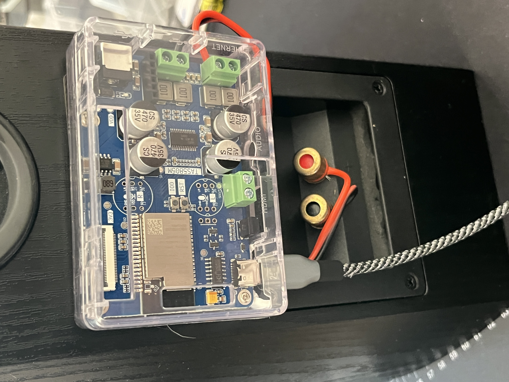
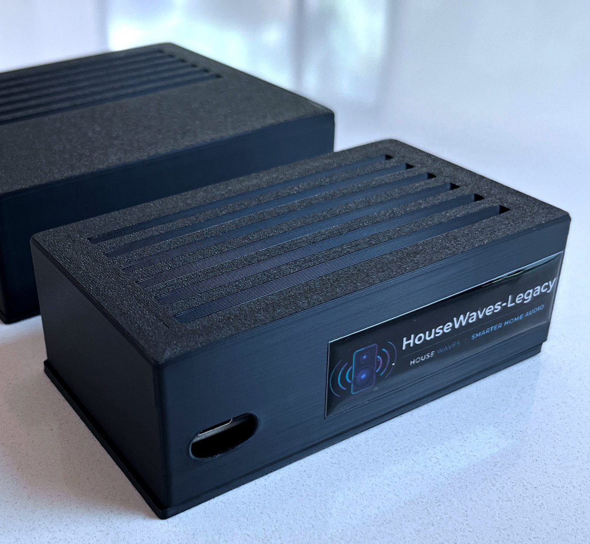
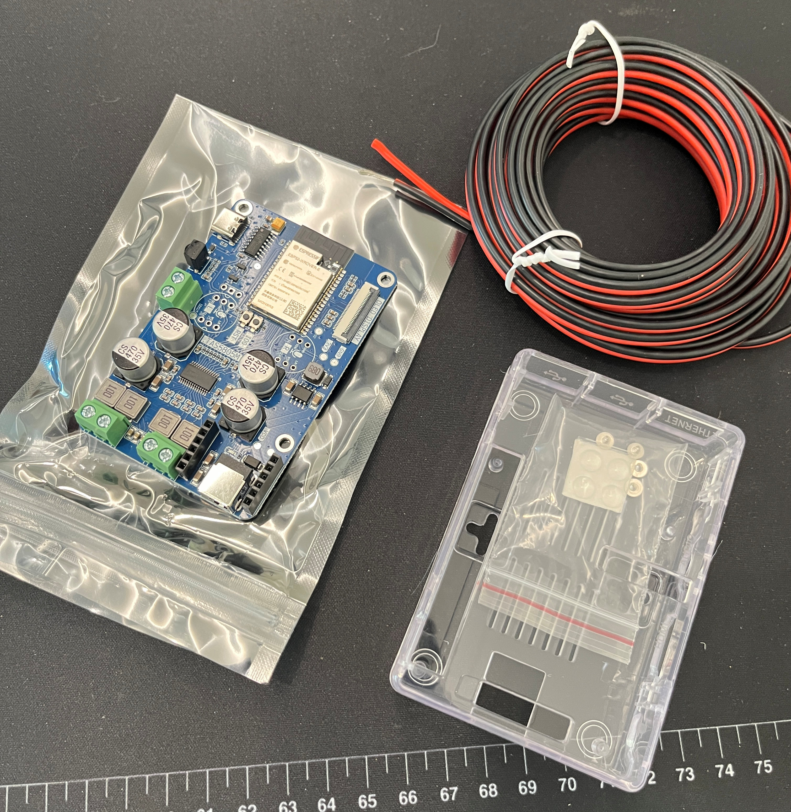
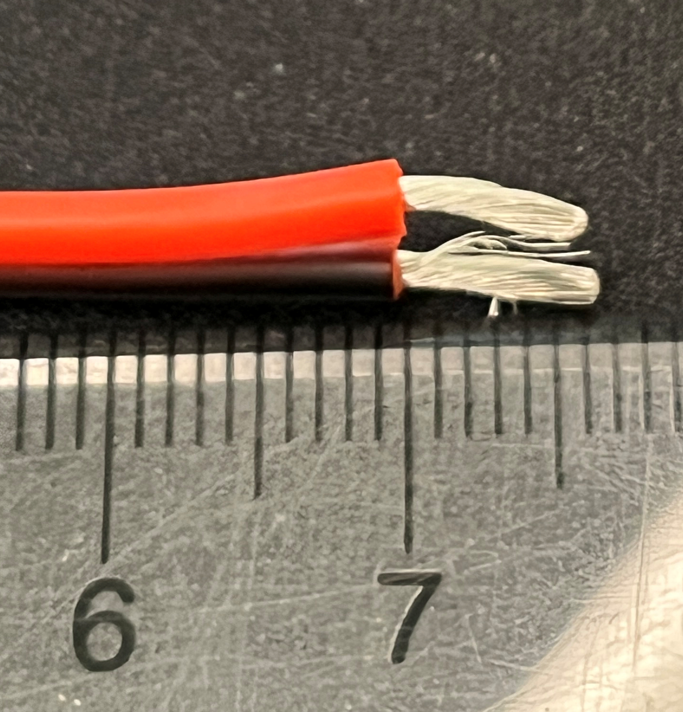
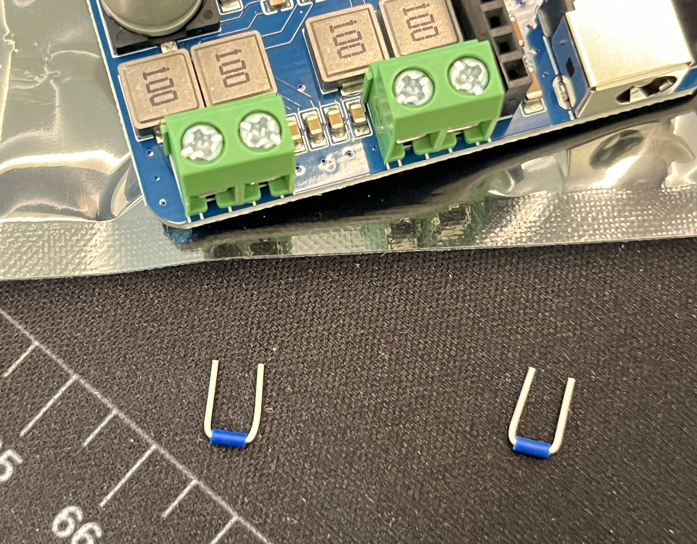
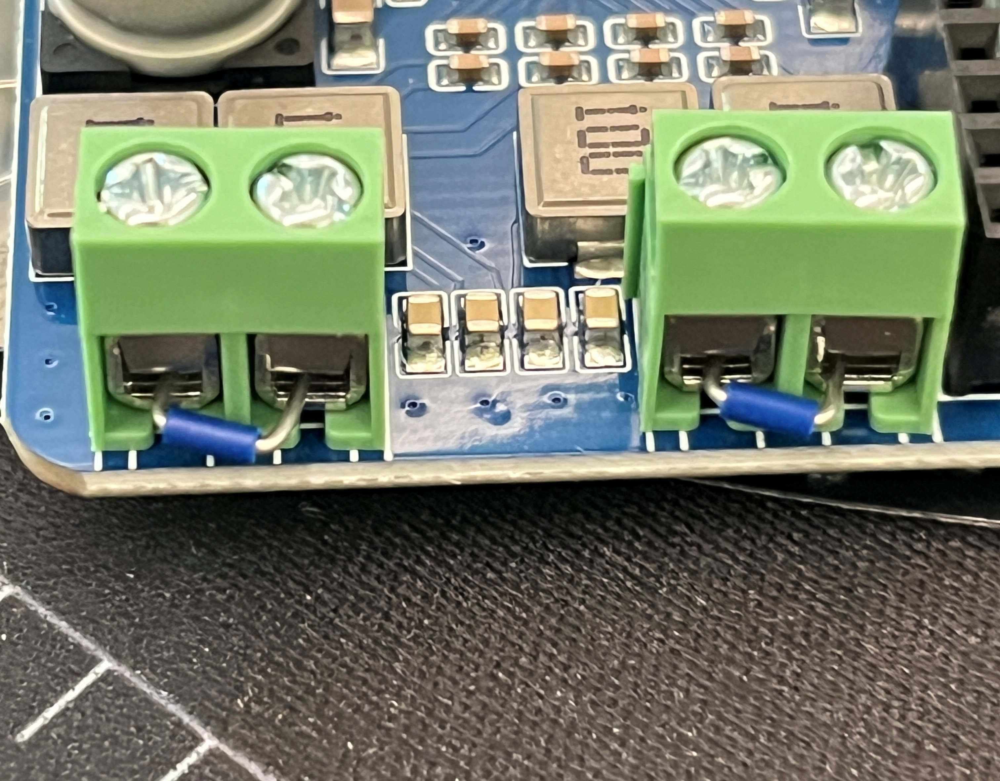
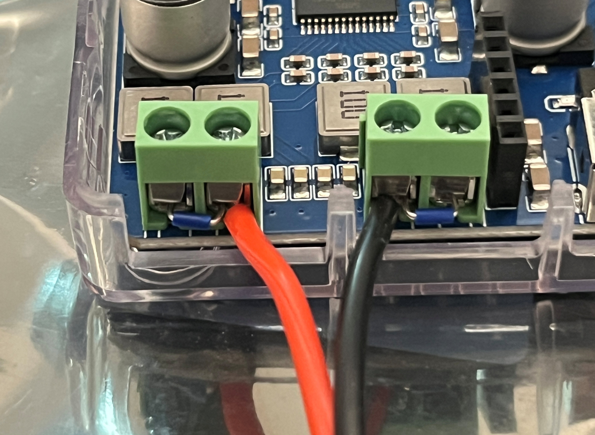
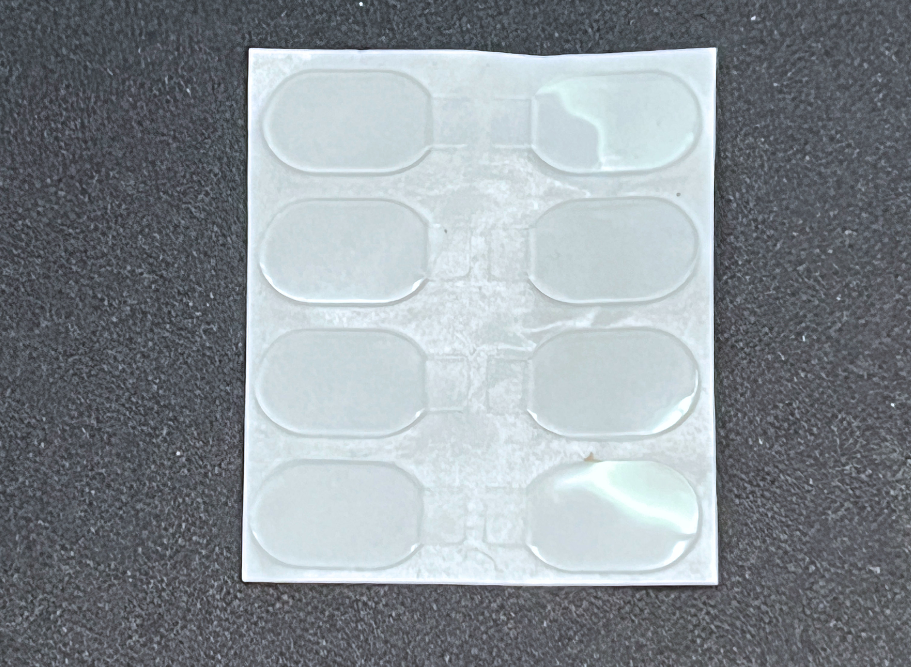
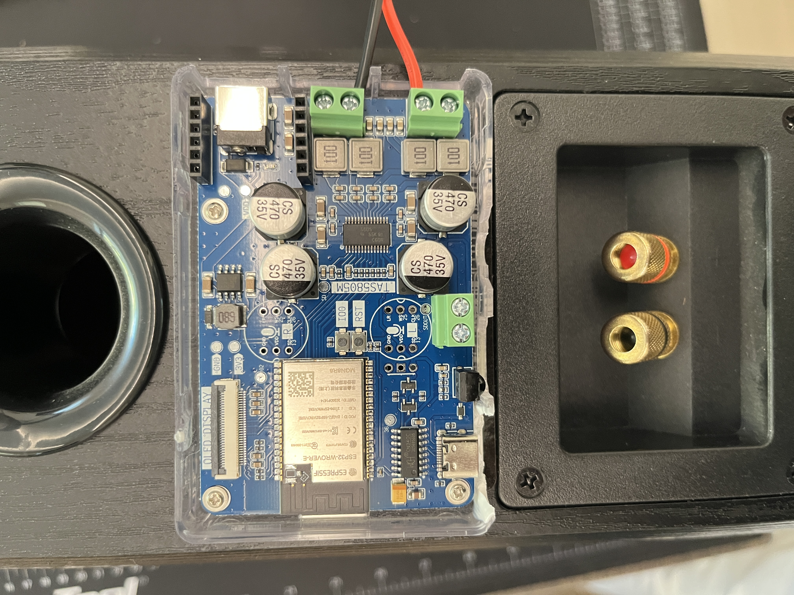

# V5 - DIY $50 Connect any passive speaker to Home Assistant with ESPHome SendSpin, Snapcast, AirPlay, Squeezelite for multi-room synchronized audio and TTS notifications.

### Quickly connect your existing passive speakers to Home Assistant using open-source hardware and open-source firmware (ESPHome with SendSpin and many other options) for multi-room synchronized audio and TTS notifications. No cloud, no subscriptions, no integrations. 

### Instead of purchasing a dedicated and expensive streaming amplifier (Wiim, Arylic, Fosi, Sonos, etc.) and then wrestling with custom HA integrations that restrict your speaker locations with speaker wires -- use this to locate them anywhere you have an outlet...

## Build or Buy ?

**This project takes minutes to build; installing firmware a little longer ;-)** 
**But not everyone has the time or desire for a DIY project.**
**If that's you, please check out the section below [Option to Purchase - Ready to Connect](#option-to-purchase---assembled-tested-ready-to-connect)**

*A passive bookshelf speaker (Pioneer) connected to Home Assistant using off-the-shelf ESP32 board.*

## See and Hear it

- **[Connect any passive speaker to Home Assistant - HouseWaves-Legacy](https://www.youtube.com/watch?v=QI0uxf1yy9A)**

---

## Table of Contents

- [What This Is](#what-this-is)

- [Motivation](#motivation)

- [Option to Purchase - Ready to Connect](#option-to-purchase---assembled-tested-ready-to-connect)

- [Thanks, Caveats & Limitations](#thanks-caveats--limitations)

- [Parts & Materials](#parts--materials)

- [Tools Required](#tools-required)

- [Build Time](#build-time)

- [Step-by-Step Build Guide](#step-by-step-build-guide)

- [What's Next](#whats-next)

- [Credits & References](#credits--references)

  

---

## What This Is 

- A documented process to quickly connect almost any passive speaker to Home Assistant, avoiding the need to purchase a separate streaming amplifier that still requires wires to connect each speaker.

- A DIY guide to adding a really exceptional open-source ESP32-based controller from Sonocotta with integrated DAC, DSP and AMP with existing, open-source firmware to stream using SendSpin, Snapcast, Squeezelite or even AirPlay 2 protocols. In this guide, I will provide directions to flash with ESPHome/SendSpin.

- Provide a viable and much less expensive alternative to purchasing Sonos, Wiim, Edifier, et al. speakers to obtain satisfying multi-room synchronized audio without the specialized integrations, cloud services or complex customizations that are generally needed for streaming audio and TTS notifications.

- **Part of a planned series modifying a range of speakers and other audio devices at multiple price points and corresponding sound quality.**
  — see [What's Next](#whats-next) for planned future builds.
  
  

**This is NOT:**

- A project that requires wood working or soldering skills.

- A project that requires any modification to your existing speaker. (Zero changes, 100% reversible)

  

---

## Motivation

There are no commercially available speakers or other audio devices specifically for use in the Home Assistant platform. Sure, you can find WiFi and BT speakers that can be integrated into HA, but they are either expensive, proprietary, complicated to integrate, etc., etc.

I wanted to change that.

***My first project***, really more of a proof-of-concept, started with a high end speaker kit. It was expensive. 
[DIY WiFi & BT audio speaker for Home Assistant, modify prebuilt 3D printed speaker](https://www.reddit.com/r/homeassistant/comments/1qw1gg6/diy_wifi_bt_audio_speaker_for_home_assistant/)

It sounded great!  But $250 / speaker was not what people wanted. 

***My second project*** was a much lower cost version based on a commonly available single-driver speaker available on Amazon. A desktop-sized solution, with limited power and frequency range, but ideal for replicating in multiple rooms primarily for notifications and occasionally listening to music (or secondary rooms as part of a whole home, multi-room system).  [V2 - $60 DIY WiFi & BT audio speaker for Home Assistant, with ESP32 - Squeezelite or SendSpin : r/homeassistant](https://www.reddit.com/r/homeassistant/comments/1skggdr/v2_60_diy_wifi_bt_audio_speaker_for_home/)

**My third project** was an off-the-shelf dual-driver, compact bookshelf speaker capable of providing quality audio with 15W to adequately fill small rooms of your home in a cabinet slightly larger than a desktop speaker.  [V3 - $90 DIY compact bookshelf speaker for Home Assistant](https://www.reddit.com/r/musicassistant/comments/1t6ah47/v3_diy_90_home_assistant_bookshelf_speaker_for/)

**My fourth project** was a larger - but still bookshelf-sized - dual-driver speaker capable of providing decent bass with significant amplification from 30W of power.  This is getting close to a substitute for home audio systems.  [V4 - $125 DIY larger bookshelf speaker for Home Assistant ](https://github.com/HouseWaves/home-assistant-audio-speaker-v4)

-------

***This is my fifth project (V5)*** 

Most every music lover has a pair of passive speakers stored away or connected to a rarely used legacy amplifier.  

Project Legacy was driven by conversations with individuals who wanted a simple means to connect and power their existing speakers to Home Assistant.

Using Sonocotta's existing ESP32 audio boards - complete with their firmware libraries, you can quickly place a board into a Raspberry Pi case and connect it to your speaker with just two wires.

---

## Option to Purchase - Assembled, Tested, Ready to Connect

My motivation is not completely altruistic.

I've started a company - with a commitment to prioritize and provide DIY open-source audio options to Home Assistant enthusiasts.  These guides are part of that commitment.

For individuals who prefer to purchase a device that is fully assembled with installed firmware that has been tested and will be continuously updated, well...that's the market I'd like to help with...I want to be the RATGDO for music enthusiasts looking for open-source audio option.

Please check out my site, [GetHouseWaves.com](https://gethousewaves.com/hw-legacy)  to view Legacy controllers and more - all using the same open-source controllers and firmware you'll find in my DIY guides. Each device is fully-assembled, flashed with ESPHome firmware, tested, updated regularly and warranted to provide a fantastic user experience. 

*Two Legacy models with higher power option available. Option to mount OVER and HIDE the speaker terminals.* 

---

## Thanks, Caveats & Limitations

- Speaker DAC and AMP power is provided by a remarkable [ESP32 board called "LOUDER"](https://github.com/sonocotta/esp32-audio-dock) by [Sonocotta](https://github.com/sonocotta). 

  - Special thanks to [Andriy](https://discord.com/invite/PtnaAaQMpS) for all the help and support in my endeavor. 

- The USB-C connection requires only the most basic mobile phone chargers (USB-C at 5V, 2-3A).   

- ***Max power with USB-C adapter is around 10W - enough for bookshelf speakers.*** 

- ***For larger speakers, use Sonocotta's Louder-Plus with a dedicated power supply for 30W.*** 

  - Speakers with large drivers (woofers over 5"), floor-standing speakers and similar require power for amplification. LOUDER will work; LOUDER-PLUS will provide better amplification. Sonocotta boards do not currently use USB-PD (it's coming), so you will need external power for anything over 10W.
  
  

---

## Parts & Materials

---

Prices shown are approximate USD and include shipping, taxes and customs fees (to someone in California). 

Adjust quantities if you plan to use a pair of speakers.

Links are for the actual products I purchased for building this project.

 

| #    | Component                                                    | Qty  | Price | Notes                                                        |
| ---- | ------------------------------------------------------------ | ---- | ----- | ------------------------------------------------------------ |
| 1    | [Sonocotta LOUDER ESP32](https://www.elecrow.com/louder-esp32.html)  Sold by Elecrow   or   [Sonocotta LOUDER ESP32](https://lectronz.com/products/louder-esp32) - Sold by Lectronz | 1    | $30   | ESP32 with integrated DAC & AMP;  - no Ethernet module;  - add $5 RPi case unless printing one   Elecrow based in China but delivers to US with lower shipping & customs fees.   Lectronz is based in EU for purchasing directly from Andriy at Sonocotta    There are currently no US based suppliers for these boards.  **buy two if modifying both speakers.** |
| 2    | [16 AWG hookup or speaker wire](https://www.amazon.com/dp/B0B9J91SJ8) | 1    | $7    | wire to connect the board to your speaker terminals. Anything over 18 gauge is too thick for the board's screw terminals |
| 3    | [Adhesive tabs](https://www.amazon.com/dp/B0CSJP7X93)        | 1    | $8    | These things are fantastic for a project like this - sticky like 3M Command strips but can be easily removed. |
| 4    | Raspberry Pi case - purchased or printed                     | 1    | $5    | Purchase as add-on option with Sonocotta board, use your own or 3D print one from a maker site.  PSA: RPi cases vary significantly in their opening locations and sizes; You may need to cut out the opening for the USB-C connector.  **buy or print two if modifying both speakers.** |
|      |                                                              |      |       |                                                              |

------

## Tools Required

- Phillips screwdrivers (regular size for panel screws and small size for circuit board)
- Wire cutter/stripper
- Access to a 3D Printer if printing the RPi case
- Computer and USB-C cable (firmware install)

---

## Build Time

- Less than 1 hour per speaker.

---

## Step-by-Step Build Guide

### Step 1 — Cut and strip the speaker wire

1. Cut approximately 8" length of the 2-conductor speaker wire. 

2. Strip one end of the wires to 1/4" (for PCB connectors)

3. Cut the other ends at least 1/4" (for a speaker with spring connectors) to 1/2" (for a speaker with screw connectors)

   

*Closeup of the stripped wires for the PCB connectors.*

---

### Step 2 — Wire the board -- FOR PBTL

1. Sonocotta's boards allow users to wire the amplifiers in BTL (Bridge Tied Load) or PBTL (Parallel Bridge Tied Load).
   There is a common misconception that PBTL automatically gets you double the power/amplification - but this is only true for lower impedance (3-4 ohm) speakers. But, PBTL still splits the power between two amplifiers regardless of the speaker impedance, so this reduces electrical and thermal stress on your amplifiers (a good thing), so I am encouraging its use for this project.
   And if you have low impedance speakers, then you do get the added power (win-win). 

2. To add PBTL, you can either bridge the jumper pads on the bottom of the board (requires soldering) - OR - simply jumper the speaker terminals themselves.
   ***NOTE - DO NOT USE THE BOARD WITHOUT FIRST INSTALLING FIRMWARE WITH PBTL SETTINGS - OR YOU WILL SHORT OUT THE AMPLIFIERS***

3. To jumper the speaker connections, use two bare wires.  In the photo below, you will see I used two electrical jumpers (tinned copper wires) from an electrical breadboarding kit. You can just use a short length of solid wire - bare, or stripped at both ends.

4. The jumpers are placed between the connectors for each output - one jumper across the LEFT connectors - one jumper across the RIGHT connectors.  ***I KNOW - this sounds wrong - we are "shorting" the individual speaker terminals and the amplifier outputs.  As long as you configure the PBTL settings in the firmware before using it, the board knows how to configure the amplifier settings to change the outputs.***

   

*Closeup of the jumper connectors from a breadboard kit. Use bare wires as an alternative.*

*Closeup of the jumpers - "shorting" - left and right speaker connectors - This is correct for PBTL amplification.*

---

### Step 3 — Attach speaker driver wires to the ESP32 board

1. With PBTL wiring, the RIGHT speaker connections become the positive (RED) speaker wire connector, and the LEFT speaker connections become the negative (BLACK) speaker wire connector.

2. Attach the wires to the speaker terminals of the board, paying attention to the driver polarity.  It's easiest to rest each wire on top of the jumpers - see photo for the final configuration.

3. [You can learn more about PBTL vs BTL on Sonocotta's GitHub repo here](https://github.com/sonocotta/esp32-audio-dock#louder-tas5805m-dac)

   

*Connecting the speaker wires with jumpers to use PBTL on the Sonocotta LOUDER ESP32 circuit board.*

---

### Step 4 — (Optionally) Mount the RPi Case to the speaker

1.  You may want to rest or mount the case to the back of your speaker. Instead of drilling holes and using screws, I found these double-sided adhesive tabs.
2. Simply peel them off the paper and stick them to the back of the RPi case. Peel off the little tabs and then press to the back of your speaker.
3. These tabs are quite sticky and will easily support the board to conveniently hide it. Best of all, they can be easily removed as well.  You know those little sticky strips credit card companies use to keep the card on the paper letters they send you to peel off  - it's just like that. 

*Sonocotta Louder ESP32 board mounted to an existing legacy speaker.*

---

### Step 5 — Connect the speaker wires and USB-C

1. Attach the wires from the board to the speaker terminals in the back, keeping in mind the proper polarity.
2. Plug in a USB-C cable - from your computer to the Sonocotta ESP32 and prepare to install the firmware.

*The ESP32 audio board is ready for flashing firmware to connect your speaker to Home Assistant.*

---

### Step 6 — Flash the ESP32 audio board 

Sonocotta offers you several options for firmware - all are tested and ready to install. Options include ESPHome with SendSpin or Snapcast, Squeezelite, AirPlay, AirPlay2 and custom. You may use any of them and switch to a new one at any time. You are never locked in.

Home Assistant's standard is SendSpin - a very good option for synchronized audio and easily connecting devices to Home Assistant as it auto-discovers these devices making it quickly available for use by Music Assistant and your TTS integrations. 

This is the [tutorial to help you Install ESPHome with SendSpin](https://github.com/HouseWaves/home-assistant-passive-speaker-amplifier-v5/blob/main/README-Firmware-Flash-SendSpin.md)

**WARNING - For any firmware used, you must enable PBTL mode or you will short out and damage your amplifier.**

---

## What's Next

This is **Build #6** in a planned series of passive-to-active speaker conversions for multi-room audio with Home Assistant. 

| Build | Speaker                                                      | Status      |
| ----- | ------------------------------------------------------------ | ----------- |
| #1    | HouseWaves POC -  Tozzi One High Fidelity Speaker Kit for Home Assistant | ✅ Complete  |
| #2    | HouseWaves-One: Low-cost (sub $50) single driver speaker     | ✅ Complete  |
| #3    | HouseWaves-Two: Mid-range, mid-cost (sub$100), dual driver speaker | ✅ Complete  |
| #4    | SendSpin firmware for use with HW-One and HW-Two speakers    | ✅ Complete  |
| #5    | HouseWaves-Three: Higher fidelity speaker option for Home Assistant | ✅ Complete  |
| #6    | HouseWaves-Legacy: Connect any passive speaker to Home Assistant | ✅ Complete  |
| #7    | HouseWaves-Stream: Stream audio from Home Assistant to any legacy amplifier or powered subwoofer | 🔜 Oct. 2026 |
| #8    | PoE W5500 hat (Power over Ethernet) for your Sonocotta boards | TBD         |

---

## Preview of HouseWaves-Stream

*Coming soon...*

---

## Credits & References

- [Sonocotta Loud ESP32 Documentation](https://github.com/sonocotta/loud-esp)

- [Squeezelite Loud ESP32 Firmware Installation Page](https://sonocotta.github.io/esp32-audio-dock/)

- [Squeezelite-ESP32 GitHub Page](https://github.com/sle118/squeezelite-esp32)

- [Music Assistant for Home Assistant](https://music-assistant.io/)

- [Home Assistant Media Player Integration](https://www.home-assistant.io/integrations/media_player/)

  

---

***Build #2026-09-08 | HouseWaves, Copyright, 2026.***

